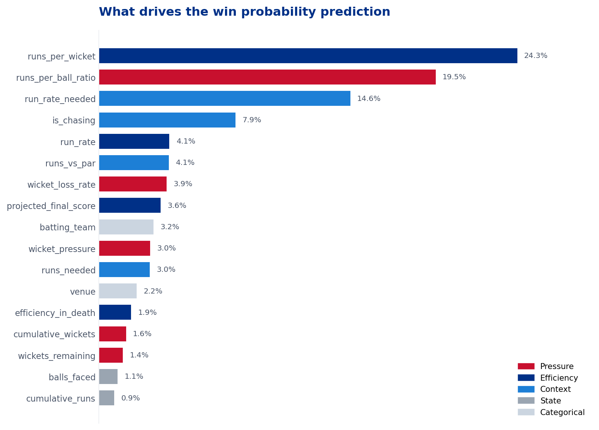
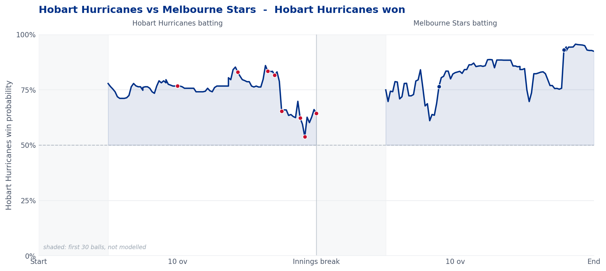

# BBL Win Probability Model

Ball-by-ball win probability for the Big Bash League, built from 647 Cricsheet matches
(2011/12 – 2025/26). The model estimates the probability that the batting side goes on
to win given the state of the match after each delivery, and uses that to measure which
deliveries actually decided a match.

---

## Results

Evaluated on 2024–2026 matches, held out entirely — no modelling decision touched them.

| Metric | Value | Baseline |
|---|---|---|
| Accuracy | 0.731 | 0.500 |
| ROC-AUC | 0.818 | 0.500 |
| Brier score | 0.175 | 0.250 |
| Fit/test gap | 0.059 | — |

Brier score is the metric that matters most here. The model outputs a probability, not a
verdict, and accuracy only checks which side of 0.5 a prediction landed on — a model can
be 73% accurate while claiming 85% confidence in situations that are really 60%.

---

## Two findings

### 1. Efficiency predicts wins. Raw runs barely do.

| Feature group | Importance |
|---|---|
| Efficiency — runs per wicket, projected score | 33.8% |
| Context — target, required rate, runs vs par | 29.5% |
| Pressure — wicket-loss rate, scoring vs wicket-loss | 29.4% |
| Categorical — team, venue | 5.3% |
| **Raw state — cumulative runs, balls faced** | **2.0%** |


Engineered features carry 92.7% of the signal. Runs and wickets on their own predict
almost nothing; it is runs *per wicket*, wickets *per over*, and runs *measured against
the target or par* that do the work.

The strongest single feature is `runs_per_ball_ratio` (24.4%) — scoring rate divided by
wicket-loss rate. It separates a side scoring freely from one scoring fast while losing
wickets, a distinction none of the individual features could express.

### 2. Setting and chasing are two different problems

| | Brier | Powerplay | Middle | Death |
|---|---|---|---|---|
| Chasing | 0.122 | 0.740 | 0.780 | **0.871** |
| Setting | 0.221 | 0.660 | 0.652 | 0.663 |

Chasing sharpens as the innings progresses — uncertainty collapses as the target nears.
Setting is **flat**: it does not improve as information accumulates, and its Brier score
barely beats a constant guess.

This is not a modelling failure. For a side batting first, the dominant uncertainty is
the innings that has not been bowled yet — knowing they finished on 180 says little
until the chase unfolds. The flat line across phases is the evidence that this
uncertainty is irreducible from first-innings data alone.

The model reached the same conclusion independently: `is_chasing` scores 8.4% importance
despite being a single binary flag, because it acts as a switch rather than a signal.
Once a tree splits on it, everything below reads the other features differently.

---

## Leverage

The change in win probability between consecutive deliveries measures how much that ball
moved the match. Ranking those changes gives the passages that actually decided it —
measured rather than eyeballed.

```
Reference: Adelaide Strikers   final win probability 11.4%
Innings break re-anchor: +26.5% (model reframing, not attributed to any delivery)

Biggest swings:
  Inn 2  16.6  136/4 HTRY Thornton to NA McSweeney   -20.8%
  Inn 2  18.5  161/5 HTRY Thornton to NA McSweeney   -17.5%
  Inn 2  13.5  105/4 MW Short to NA McSweeney        -17.3%
  Inn 2  14.2  110/4 L Scott to NA McSweeney         -16.2%
  Inn 1   9.6   60/3 W Prestwidge to CA Lynn WICKET  -15.7%
```

McSweeney appears in four of the top five, all against Adelaide — one batter dragging a
chase across the line, tracked delivery by delivery.

Two details make this more than a subtraction:

**Perspective.** The model outputs the *batting* side's probability, and the batting side
changes at the innings break. Everything is flipped to one reference team first,
otherwise the diff across that boundary compares two different quantities.

**The innings-break artifact.** An early version reported a 57% swing on the first ball
of a chase and attributed it to the bowler. Nothing happened on that ball — at the break
the model's framing changes (the target becomes known, `is_chasing` flips), so the
probability re-anchors. That jump is now excluded from the rankings and reported
separately.

Leverage behaves as it should across match types: total death-over swing was **1.265** in
a match decided in the final over against **0.010** in a one-sided one. Flat leverage in a
blowout is the correct answer, not a limitation.



---

## Method

**Data.** 663 Cricsheet JSON files, 647 usable after dropping no-results, flattened to
151,331 delivery-level rows.

**Split.** Chronological, three ways — fit (2011 to mid-2022), validation (mid-2022 to
end 2023), test (2024 onwards). Random splitting would let the model train on 2025 and
test on 2014, which is not the question being asked. The validation slice exists to keep
early stopping away from the test set; watching test loss to decide how many trees to
build would let the test set influence a modelling decision.

Deliveries before ball 30 are dropped — a prediction two balls in carries almost no
information and pulls the model toward noise. Filtering lifted accuracy from 0.635 to
0.652 and AUC from 0.702 to 0.718.

**Model.** XGBoost, 400 rounds max with early stopping at 40, `max_depth=4`,
`learning_rate=0.03`, `min_child_weight=20`, `reg_lambda=5.0`.

The first version (300 trees, depth 6, no penalty) memorised: fit accuracy 0.883 against
test 0.727, a 15-point gap. Regularisation cut that to 6 points while test accuracy held
and **AUC rose** — the sign that what was removed was noise rather than signal.

That same change fixed the calibration. Before it, the 0.83 confidence band won only 64%
of the time, a 19-point overstatement in exactly the range a coach would act on. A
memorising model has seen its training patterns resolve cleanly, so it pushes
probabilities toward the extremes; fixing the overfitting fixed the overconfidence.

**Leakage prevention.** Two paths closed:

- `target_score` is left NaN for the first innings. Giving that side its own eventual
  total would hand the model the answer mid-innings.
- Par scores are fitted on training matches only, then applied to both splits. Computing
  them across the full dataset would fold test-period information into training.

`fit_par_table()` takes training data as an argument, so this protection is enforced by
the API rather than left to memory.

---

## Repository

```
bbl-win-probability/
├── data/
│   └── cricsheet_jsons/            # 663 match files (not committed)
├── notebooks/
│   └── 01_win_probability_model.ipynb
├── src/
│   ├── features.py                 # feature engineering, shared by train and inference
│   └── leverage.py                 # win probability change per delivery
├── outputs/
├── .gitignore
└── README.md
```

Feature engineering lives in `src/features.py` rather than the notebook so that training
and any future inference call the same code. Recomputing features separately at serving
time is the standard way these systems fail — not with a crash, but by quietly drifting
apart.

**Running it:** place Cricsheet BBL JSONs in `data/cricsheet_jsons/` and run the
notebook top to bottom. Requires `pandas`, `numpy`, `xgboost`, `scikit-learn`,
`matplotlib`.

---

## Limitations

- **No player identity.** The model sees 112/2 after 12 overs without knowing whether an
  opener or a number nine is on strike. The largest remaining gap, and the next thing to
  build.
- **Mild mid-range overconfidence.** The calibration table leans roughly +0.05 to +0.10
  through the 0.45–0.75 bands. Left uncorrected deliberately — a small adjustment where
  the model is already hedging does not change its usefulness, and a calibration wrapper
  is more machinery to maintain than the gain justifies.
- **Understatement at the extremes.** The regularisation that fixed overconfidence also
  compressed the model's reach toward certainty. In one-sided matches it settles around
  96–99% and stops moving.
- **Static par scores.** Medians across all training seasons, so they do not reflect that
  scoring rates have risen over fifteen years.
- **No hyperparameter search.** Settings are reasoned rather than tuned.

---

## Three bugs worth recording

Each produced output that looked entirely reasonable.

**Match identity.** Deriving it from `match_date` merged matches — the BBL plays several
games on the same day, which produced innings numbers running 1 to 6 instead of 1 to 2.
Fixed by keying on the filename.

**Wides inflating the ball count.** Wides and no-balls do not consume a legal ball.
Counting them pushed innings past 120, made `balls_remaining` negative, and produced an
infinite required run rate that XGBoost refused to train on. The crash was the lucky
outcome — rows just past the boundary gave a required run rate of −36, which would have
trained silently.

**Ranking matches by runs margin.** Intended to find close finishes, it returned only
matches with a margin of exactly 1 — because a successful chase stops the moment the
target is passed. It was finding successful chases, not close ones. Depth into the
innings is what separates a tense finish from a routine one.
